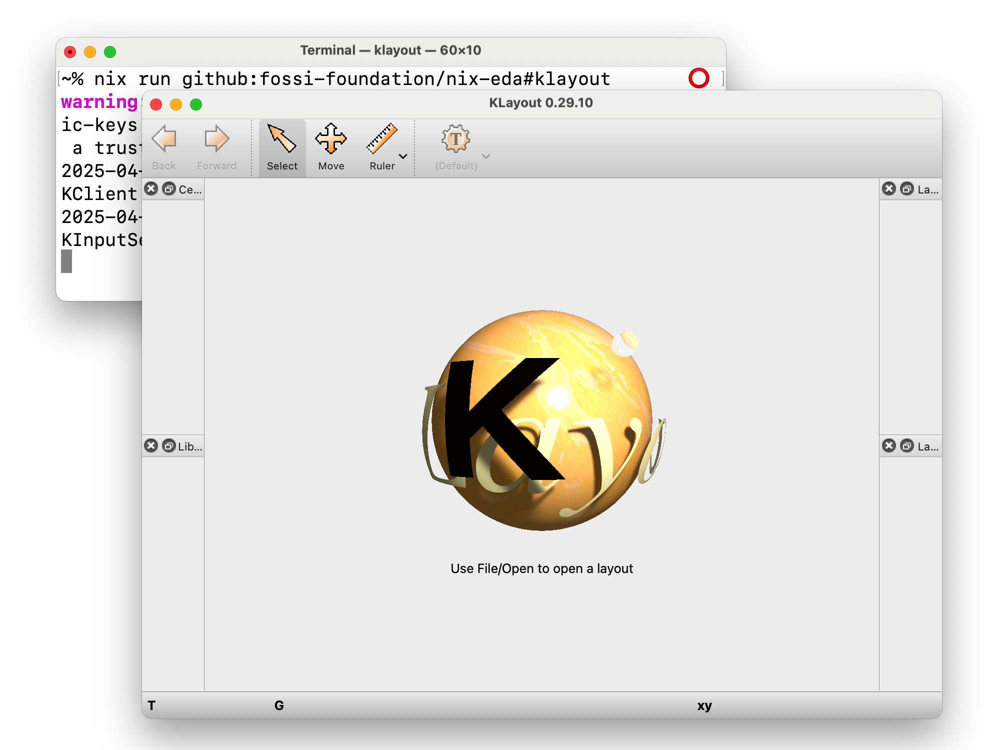

# ❄️ nix-eda



A [flake](https://nixos.wiki/wiki/Flakes) containing a collection of Nix
derivations for EDA (Electronic Design Automation) utilities.

> nix-eda is not affiliated with the NixOS Foundation or any of its affiliates.

We compile and cache the tools for the following platforms:

| Platform | Nix System Name |
| - | - |
| Linux (x86_64) | `x86_64-linux` |
| Linux (aarch64) | `aarch64-linux` |
| macOS (x86_64) | `x86_64-darwin` |
| macOS (arm64) | `aarch64-darwin` |

## Tools Included
* [Magic](http://opencircuitdesign.com/magic)
* [Netgen](http://opencircuitdesign.com/netgen)
* [ngspice](https://ngspice.sourceforge.io)
* [KLayout](https://klayout.de)
    * (+ `.python3.pkgs.klayout` for Python module)
* [GDSFactory](https://github.com/gdsfactory/gdsfactory)
    * (+ `klayout-gdsfactory` as a shorthand for an environment with both installed)
* [Verilator](https://verilator.org)
* [Xschem](https://xschem.sourceforge.io/stefan/index.html)
* [Xyce](https://github.com/xyce/xyce)
    * Linux only.
* [Yosys](https://github.com/YosysHQ/yosys)
    * (+ `python3.pkgs.pyosys` for Python module)
    * (+ some plugins that can be accessed programmatically)
    * (`yosysFull` for all plugins)
    
> [!NOTE]  
> As of the time of writing, if you're using KLayout andgdsfactory for sky130
> PCells, the versions of klayout and gdsfactory in nix-eda 5.0.0+ are 
> incompatible as the PCells are out-of-date.
>
> You can pull the latest working version, nix-eda 4.3.1, (based on NixOS 24.05) 
> as follows:
>
> `nix shell github:fossi-foundation/nix-eda/4.3.1#klayout-gdsfactory`

## Installation

See [docs/installation.md](./docs/installation.md).

## Usage

You may use any of the tools by creating a Terminal shell with the tool as
follows:

```sh
nix shell github:fossi-foundation/nix-eda#magic
```

Then you would be able to simply type `magic`.

You may also create a shell with multiple tools as follows:

```sh
nix shell github:fossi-foundation/nix-eda#{magic,xschem}
```

### Flake API

See [docs/flake_api.md](./docs/flake_api.md).

## ⚖️ License

The combined work is available under the Apache License, version 2.0.
See 'License'. See [Authors.md](./Authors.md) for a list of authors and
copyright holders.

We are eventually planning to relicense under the MIT License (to be compatible
with nixpkgs upstream) and we kindly ask all new contributions to be under said
license.

Binary cache is hosted by the FOSSi Foundation.

nix-eda is based on [nix-eda](https://github.com/efabless/nix-eda)
by Efabless Corporation:

```
Copyright 2024 Efabless Corporation

Licensed under the Apache License, Version 2.0 (the "License");
you may not use this file except in compliance with the License.
You may obtain a copy of the License at

     http://www.apache.org/licenses/LICENSE-2.0

Unless required by applicable law or agreed to in writing, software
distributed under the License is distributed on an "AS IS" BASIS,
WITHOUT WARRANTIES OR CONDITIONS OF ANY KIND, either express or implied.
See the License for the specific language governing permissions and
limitations under the License.
``` 
